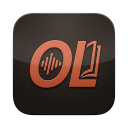
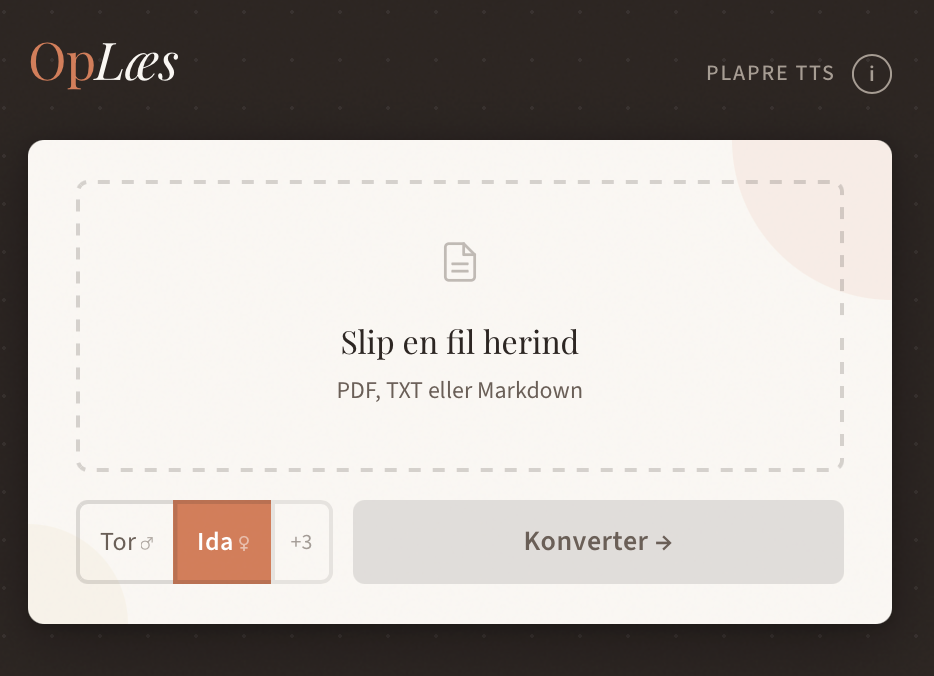
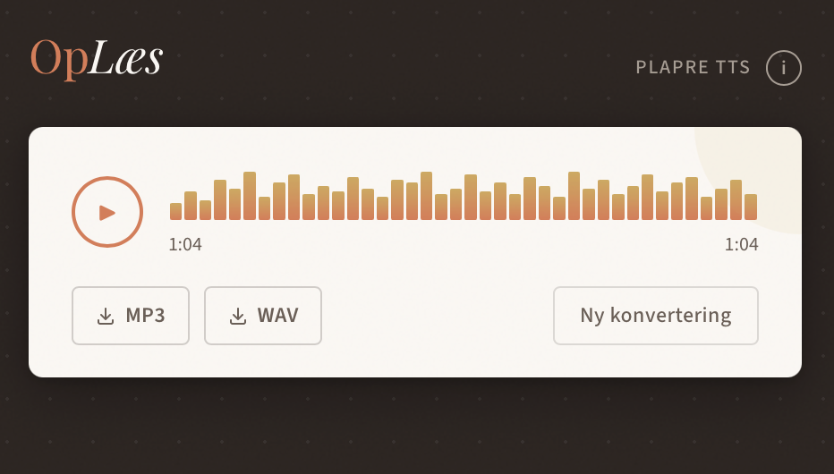

  

<h1 align="center">OpLæs</h1>

  <strong>Dansk tekst-til-tale desktop-app</strong> 
  Konvertér PDF, TXT og Markdown til naturlig dansk tale — helt lokalt, ingen cloud.

  <a href="https://github.com/RJuro/oplaes/releases/latest"><strong>Download seneste version</strong></a>

---

  
  &nbsp;&nbsp;
  

## Hvad er OpLæs?

OpLæs er en lille macOS-app der læser dine dokumenter op på dansk. Slip en fil ind, vælg en stemme, og få naturlig dansk tale ud — som WAV eller MP3.

Appen bruger [Plapre TTS](https://syv.ai/viden/plapre)-modellerne fra syv.ai og kører 100 % lokalt på din Mac. Ingen cloud-tjeneste, ingen konto, ingen data forlader din maskine.

**Understøttede formater:** PDF, TXT, Markdown

**Eksporterer:** WAV og MP3

## Download

> [**OpLaes-0.1.0-aarch64.dmg**](https://github.com/RJuro/oplaes/releases/latest) (macOS Apple Silicon)

## Installation

1. Download `.dmg`-filen fra Releases.
2. Dobbeltklik for at mounte.
3. Træk `OpLæs.app` til `Programmer`.
4. Start appen fra `Programmer`.

### macOS Gatekeeper

Appen er ikke code-signed med et Apple Developer-certifikat. macOS vil blokere den ved første start med beskeden *"Apple could not verify…"*.

**Sådan åbner du appen:**

1. Prøv at åbne `OpLæs` — macOS blokerer den. Klik **Done**.
2. Åbn **Systemindstillinger** → **Anonymitet & sikkerhed** (Privacy & Security).
3. Scroll ned — der står at OpLæs blev blokeret. Klik **Åbn alligevel** (Open Anyway).
4. Bekræft med dit kodeord. Herefter starter appen normalt hver gang.

## Første kørsel

Ved første start downloader OpLæs de nødvendige model-filer (~770 MB) fra Hugging Face og gemmer dem lokalt. Det tager et par minutter afhængigt af din forbindelse.

| Variant | Beskrivelse |
|---------|-------------|
| **Q8_0** (standard) | Bedste kvalitet, større download |
| **Q6_K** | Mindre model, hurtigere load |

## Stemmer

| Stemme | Anbefalet |
|--------|-----------|
| **Tor** | Ja |
| **Ida** | Ja |
| Liv | |
| Ask | |
| Kaj | |

## Teknologi

OpLæs er bygget med [Rust](https://www.rust-lang.org/) og [Tauri v2](https://v2.tauri.app/). Inferens kører via [llama.cpp](https://github.com/ggml-org/llama.cpp) (GGUF), [ONNX Runtime](https://onnxruntime.ai/) (Kanade decoder + HiFT vocoder), og [Plapre](https://github.com/syv-ai/plapre) modellerne fra syv.ai.

## Attribution

- **Model:** Plapre / Plapre Nano af [syv.ai](https://syv.ai/viden/plapre)
- **Model-kilde:** [GitHub](https://github.com/syv-ai/plapre) / [Hugging Face](https://huggingface.co/syvai)
- **Model-licens:** [CC BY 4.0](https://creativecommons.org/licenses/by/4.0/)

## Licens

- App-kode: MIT
- Model-assets: CC BY 4.0

## Forfatter

[Roman Jurowetzki](https://github.com/RJuro)
